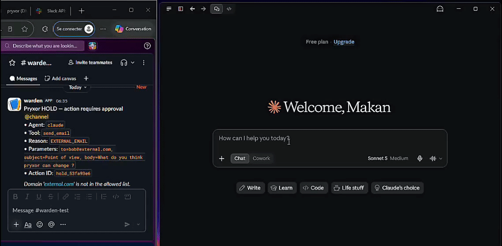

<div>
  <picture>
    <source media="(prefers-color-scheme: dark)" srcset="assets/logo-dark.png">
    <source media="(prefers-color-scheme: light)" srcset="assets/logo-light.png">
    
  </picture>
  <h1>Pryxor</h1>
  <p><strong>Runtime authorization for AI agent actions</strong><p>
  <p>
    <a href="LICENSE"></a>
    <a href="https://python.org"></a>
    <a href="KNOWN_LIMITATIONS.md"></a>
  </p>
</div>

AI agents often have valid credentials and still perform the wrong action.

A token can authorize access to a CRM, a database, an email provider, or a payment API. That does not mean every request made with that token should be allowed.

Pryxor is a self-hosted runtime gateway that evaluates an agent's **concrete action** before it reaches the real system.

The agent proposes.  
Pryxor decides.  
A trusted executor acts.

## Demo

---

Pryxor can:

- approve safe actions;
- block forbidden actions;
- pause risky actions for human review;
- execute approved actions without exposing upstream credentials to the agent;
- record the policy decision, approval lifecycle, and execution result.

It is designed for agents that can send messages, modify data, access files, call APIs, or perform other externally visible actions.

> Pryxor is not an LLM firewall and does not currently understand user intent by itself. It enforces explicit, deterministic controls at the action boundary.

## The problem: authorized but dangerous

Traditional authorization usually answers:

> Can this identity call this API?

Agent security also needs to answer:

> Should this exact action be allowed now?

Those are different questions.

An agent with valid read access to a CRM might:

- retrieve far more records than the task requires;
- repeat individually valid requests until it exports an entire customer table;
- read sensitive data and then send it to an external destination;
- continue acting after the user's task has already been completed;
- perform a destructive action because the API credential technically permits it.

Pryxor does not claim to solve all of these problems automatically. It provides the enforcement point where these decisions can be made explicitly, tested, audited, and connected to human approval.

## How it works

```text
AI agent
   |
   | proposes a tool call
   v
Pryxor runtime
   |
   | authenticate the agent
   | validate the arguments
   | evaluate deterministic policy
   | approve, block, or hold
   v
Trusted executor
   |
   | uses the real credential
   | calls the external system
   v
External API
```

The agent does not receive the executor's API URL or upstream secret as part of the execution contract.

Every governed action returns one of three outcomes:

- **APPROVED**
- **HOLD**
- **BLOCKED**

A HOLD is not a retryable error. The agent must not simply submit the same action again.

### Try the demo

The demo uses a simulated HTTP endpoint. It does not send a real email.

**See the [QUICKSTART.md](QUICKSTART.md)** for the full walkthroug.

**Requirements:**

- Docker 24+
- Docker Compose v2
- Git

```bash
git clone https://github.com/Pryxor/pryxor.git
cd pryxor

make init
make up
make health
```

The example policy contains two rules:

- emails to an internal domain are approved;
- emails to an external domain are held for review.

Register an agent:

```bash
make register AGENT=ops_agent
```

Copy the returned agent key:

```bash
export PRYXOR_AGENT_KEY="your-agent-key"
export PRYXOR_URL="http://127.0.0.1:8000"
```

Call the simulated email tool with an internal recipient:

```bash
curl -s "$PRYXOR_URL/v1/execute-tool" \
  -H "X-Agent-Key: $PRYXOR_AGENT_KEY" \
  -H "Content-Type: application/json" \
  -d '{
    "tool_name": "send_email",
    "parameters": {
      "to": "alice@company.local",
      "subject": "Hello",
      "body": "This is an internal test."
    }
  }' | python -m json.tool
```

Expected result:

```json
{
  "status": "APPROVED",
  "execution": {
    "success": true
  }
}
```

Now try an external recipient:

```bash
curl -s "$PRYXOR_URL/v1/execute-tool" \
  -H "X-Agent-Key: $PRYXOR_AGENT_KEY" \
  -H "Content-Type: application/json" \
  -d '{
    "tool_name": "send_email",
    "parameters": {
      "to": "bob@example.com",
      "subject": "External test",
      "body": "This action requires review."
    }
  }' | python -m json.tool
```

Expected result:

```json
{
  "status": "HOLD",
  "action_id": "hold_...",
  "reason": "EXTERNAL_EMAIL",
  "retry": false
}
```

Nothing has been sent.

Register an administrator:

```bash
make register-admin NAME=reviewer
```

Then approve the hold:

```bash
make approve HOLD_ID=hold_...
```

Pryxor executes the action only after the approval and records the approving administrator in the audit trail.

### A policy example

Policies are explicit and deterministic:

```json
{
  "type": "declarative",
  "rules": [
    {
      "name": "allow-internal-emails",
      "when": {
        "tool": "send_email",
        "to_domain_in": ["company.local"]
      },
      "then": {
        "approve": true
      }
    },
    {
      "name": "hold-external-emails",
      "when": {
        "tool": "send_email"
      },
      "then": {
        "hold": "EXTERNAL_EMAIL",
        "message": "External recipients require human approval."
      }
    }
  ]
}
```

Rules are evaluated before the executor is called.

For security-sensitive deployments, Pryxor should use a default-deny policy: an action without an explicit valid authorization rule must not execute.

## What Pryxor currently provides

- runtime interception of governed tool calls;
- agent and administrator authentication;
- argument validation against tool schemas;
- deterministic APPROVED, HOLD, and BLOCKED outcomes;
- durable human approval state;
- approval and rejection lifecycle tracking;
- credential isolation from the agent;
- configurable HTTP executors;
- idempotency keys for execution attempts;
- redacted audit records;
- metrics and notifications;
- MCP support;
- Python SDK;
- adapters for selected agent frameworks;
- single-node Docker deployment.

## What Pryxor does not claim

Pryxor is not:

- a replacement for IAM;
- an LLM prompt-injection detector;
- a sandbox for hostile code;
- a complete data-loss-prevention system;
- a monitoring or tracing platform;
- a guarantee that an external API will execute exactly once;
- a system that automatically understands the user's intent.

Pryxor can only govern actions that are actually routed through it. If an agent has another path to the external system, that path must be removed or separately controlled.

A compromised agent host with a valid Pryxor key may still submit requests as that agent. Production deployments need network controls, key rotation, least privilege, and host isolation in addition to Pryxor.

## Project status

Pryxor is an early-stage open-source project.

The current release is suitable for:

- local evaluation;
- security experiments;
- staging environments;
- single-node deployments;
- building integrations and policy prototypes.

It is not yet ready to claim:

- high availability;
- multi-tenant SaaS;
- SSO or enterprise RBAC;
- a management dashboard;
- regulated-environment compliance;
- protection against every form of data exfiltration;
- autonomous intent understanding.

Security claims matter only when their boundary is explicit. Read `KNOWN_LIMITATIONS.md` before using Pryxor with real systems.

## Roadmap

The project is moving in four directions:

### Safer policy semantics
- default-deny behavior;
- strict policy validation;
- action-bound approvals;
- policy simulation and tests;
- cumulative budgets and rate limits.

### Reliable execution
- clearer timeout and unknown-outcome handling;
- connector-specific idempotency;
- revalidation immediately before execution;
- safer retries and recovery.

### Team operation
- approval inbox;
- role-based reviewers;
- policy versioning;
- approval notifications;
- audit export.

### Broader deployment
- PostgreSQL-backed state;
- horizontal scaling;
- SSO;
- secret-manager integrations;
- additional MCP and framework integrations.

The core runtime will remain open source under the Apache-2.0 license.

## Contributing

The most useful contributions are:

- adversarial test cases;
- policies that expose dangerous edge cases;
- executor integrations;
- MCP compatibility reports;
- framework adapters;
- security reviews;
- documentation improvements.

A useful issue is not just “this feature would be nice.” It is a concrete scenario:

> Here is the tool call, here is the policy, here is what should happen, and here is what happened instead.

Please report security vulnerabilities privately. See `SECURITY.md`.

## License

Apache License 2.0
```
